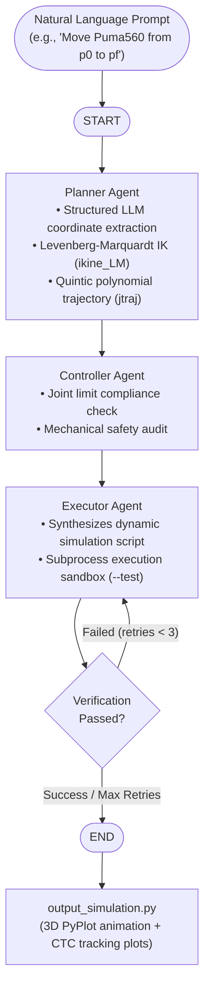

# Robotics Agents Orchestration

A multi-agent robotics motion planning and code generation system powered by **LangGraph**, **Google Gemini**, and Peter Corke's **Robotics Toolbox for Python (`roboticstoolbox-python`)**.

The system translates natural language motion commands into mathematically verified trajectories and dynamic simulation scripts for a 6-DOF **Puma 560** industrial robotic manipulator, featuring automated test execution and self-correcting feedback loops.

---

## System Architecture



---

## The Multi-Agent Pipeline

1. **Planner Agent (`agents/planner.py`)**
   - Parses 3D start ($p_0$) and destination ($p_f$) Cartesian coordinates using Gemini structured outputs.
   - Computes dynamic trajectory references: joint angles ($q$), velocities ($\dot{q}$), and accelerations ($\ddot{q}$) via Puma 560 inverse kinematics.

2. **Controller Agent (`agents/controller.py`)**
   - Validates generated trajectories against physical robot hardware bounds ($q_{lim}$) before any code is generated.
   - Rejects configurations violating mechanical constraints.

3. **Executor Agent (`agents/executor.py`)**
   - Synthesizes a standalone, fully executable Python simulation script.
   - Implements **Computed Torque Control (CTC)** via inverse dynamics (Recursive Newton-Euler `puma.rne`) and forward dynamics (`puma.accel`).
   - Generates 3D robot arm animation (`rtb.backends.PyPlot`) and 3-tier Matplotlib tracking performance plots ($q, \dot{q}, \ddot{q}$).
   - Verifies runnable code safety inside an isolated subprocess test sandbox (`--test` flag).

4. **Self-Correction Feedback Loop (`main.py`)**
   - Orchestrated with a LangGraph state machine.
   - If simulated execution times out or encounters runtime errors, the error traceback is routed back to the Executor for automatic self-correction (up to 3 retries).

---

## Project Structure

```plaintext
robotics-agents-orchestration/
├── .vscode/
│   └── settings.json             # VS Code Conda environment configuration
├── agents/
│   ├── __init__.py               # Agent module exports
│   ├── controller.py             # Safety & joint limit audit agent
│   ├── executor.py               # Simulation code synthesis & sandbox testing
│   ├── planner.py                # Coordinate extraction & trajectory planner
│   └── robotics.py               # Shared Gemini model initialization
├── prompts/
│   ├── controller_prompt.md      # Safety audit agent instructions
│   ├── executor_prompt.md        # Code synthesis prompt & simulation specifications
│   └── planner_prompt.md         # Motion extraction constraints
├── tools/
│   └── robotics_tools.py         # Puma 560 IK solver & joint limit validator
├── main.py                       # LangGraph orchestration pipeline & CLI entrypoint
├── state.py                      # RobotAgentState TypedDict definition
├── requirements.txt              # Project dependencies
└── README.md                     # Project documentation
```

---

## Getting Started

### 1. Prerequisites & Environment Setup

Clone the repository and set up a Conda environment:

```bash
# Clone the repository
git clone https://github.com/emnix404/robotics-agents-orchestration.git
cd robotics-agents-orchestration

# Create and activate conda environment
conda create -n robot-agents python=3.13 -y
conda activate robot-agents

# Install dependencies
pip install -r requirements.txt
```

### 2. Configure API Keys

Create a `.env` file in the project root:

```env
GOOGLE_API_KEY=your_gemini_api_key_here
```

### 3. Run the Orchestrator

Execute the multi-agent pipeline to generate and verify a simulation:

```bash
python main.py
```

The agents will coordinate, plan the trajectory, validate safety bounds, and synthesize a verified simulation script saved as `output_simulation.py`.

### 4. Run the Generated Simulation

Launch the 3D PyPlot robot animation and dynamic tracking performance plots:

```bash
python output_simulation.py
```

---

## Tech Stack

- **Agent Orchestration:** [LangGraph](https://github.com/langchain-ai/langgraph), [LangChain](https://github.com/langchain-ai/langchain)
- **Foundation Model:** Google Gemini (`gemini-3.6-flash`) via `langchain-google-genai`
- **Robotics & Dynamics:** [Robotics Toolbox for Python (RTB-P)](https://github.com/petercorke/robotics-toolbox-python), [Spatial Math](https://github.com/petercorke/spatialmath-python)
- **Simulation & Visualization:** NumPy, Matplotlib, PyPlot